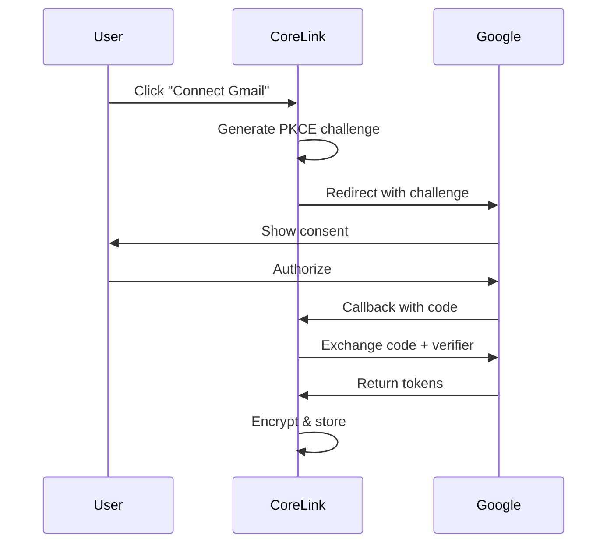

# CoreLink - Project Overview for Claude

**Last Updated**: 2025-02-21
**Version**: 0.1.0
**Status**: Active Development

---

## 🎯 What is CoreLink?

CoreLink is a **local-first, open-source gateway** that sits between AI agents (like Claude Code) and your workspace applications (Gmail, Outlook, Todoist, etc.). It provides:

- 🔒 **Granular access control** - Define exactly what AI agents can and cannot access
- 🔌 **Service abstraction** - AI agents use universal tools (`list_emails`) that work with Gmail or Outlook
- 📝 **Complete audit logging** - Track every AI action
- 🛡️ **Privacy-first** - All data stays local (SQLite)
- 🚀 **Extensible** - Easy plugin system for new services

---

## 📊 High-Level Architecture

```mermaid
graph TB
    subgraph "AI Agents Layer"
        A1[Claude Code]
        A2[ChatGPT]
        A3[Custom AI Agents]
    end

    subgraph "CoreLink Gateway"
        direction TB
        MCP[MCP Server<br/>Tool Registry]

        subgraph "Core Services"
            PE[Policy Engine<br/>json-logic-js]
            AL[Audit Logger<br/>SQLite]
            CM[Credential Manager<br/>AES-256-GCM]
        end

        PL[Plugin Loader<br/>Dynamic Discovery]

        MCP --> PE
        PE --> AL
        PE --> PL
        PL --> CM
    end

    subgraph "Plugins Layer"
        direction LR
        P1[📧 Gmail<br/>Plugin]
        P2[📨 Outlook<br/>Plugin]
        P3[✓ Todoist<br/>Plugin]
    end

    subgraph "Web Dashboard"
        UI[React + Vite<br/>TailwindCSS]
        REST[REST API<br/>Fastify]
    end

    subgraph "Data Layer"
        direction TB
        DB[(SQLite<br/>Database)]
        ENC[Encryption<br/>Layer]
        FS[File System<br/>.corelink/]
    end

    subgraph "External APIs"
        E1[Gmail API]
        E2[Microsoft Graph]
        E3[Todoist API]
    end

    A1 & A2 & A3 -.MCP Protocol.-> MCP

    UI --> REST
    REST --> CM
    REST --> AL
    REST --> PE

    PL --> P1 & P2 & P3

    P1 -.OAuth 2.0.-> E1
    P2 -.OAuth 2.0.-> E2
    P3 -.OAuth 2.0.-> E3

    CM --> ENC
    AL --> DB
    PE --> DB
    ENC --> DB
    DB --> FS

    classDef ai fill:#667eea,stroke:#5a67d8,color:#fff
    classDef core fill:#f59e0b,stroke:#d97706,color:#fff
    classDef plugin fill:#10b981,stroke:#059669,color:#fff
    classDef data fill:#3b82f6,stroke:#2563eb,color:#fff
    classDef ui fill:#8b5cf6,stroke:#7c3aed,color:#fff

    class A1,A2,A3 ai
    class MCP,PE,AL,CM,PL core
    class P1,P2,P3 plugin
    class DB,ENC,FS data
    class UI,REST ui
```

---

## 📁 Project Structure

```
CoreLink/
├── docs/                      # 📚 All documentation
│   ├── ARCHITECTURE.md        # System design & architecture
│   ├── TODO.md                # Development roadmap
│   ├── OUTLOOK_SETUP.md       # Microsoft OAuth setup guide
│   ├── idea.txt               # Original concept document
│   └── dev.txt                # Development guide
│
├── packages/                  # 📦 Monorepo packages
│   ├── core/                  # Shared types & interfaces
│   │   └── src/
│   │       ├── types/         # TypeScript definitions
│   │       │   ├── plugin.ts  # ICoreLinkPlugin interface
│   │       │   ├── policy.ts  # Policy types
│   │       │   └── audit.ts   # Audit log types
│   │       └── index.ts       # Exports & constants
│   │
│   ├── gateway/               # 🚪 Backend server
│   │   └── src/
│   │       ├── mcp/           # MCP server (TODO)
│   │       ├── services/      # Core services
│   │       │   ├── credential-manager.ts  # OAuth token storage
│   │       │   ├── policy-engine.ts       # (TODO)
│   │       │   └── audit-logger.ts        # (TODO)
│   │       ├── routes/        # HTTP routes
│   │       │   ├── oauth.ts              # Gmail OAuth
│   │       │   └── outlook-oauth.ts      # Outlook OAuth
│   │       ├── crypto/        # Security
│   │       │   ├── encryption.ts  # AES-256-GCM
│   │       │   └── pkce.ts        # OAuth PKCE
│   │       ├── db/            # Database
│   │       │   ├── schema.ts      # Drizzle schema
│   │       │   └── index.ts       # DB connection
│   │       └── index.ts       # Server entry point
│   │
│   └── web/                   # 🌐 Web dashboard
│       └── src/
│           ├── App.tsx        # Main React app
│           └── main.tsx       # Entry point
│
├── plugins/                   # 🔌 Service plugins
│   ├── gmail/                 # Gmail connector
│   │   └── src/index.ts       # GmailPlugin class
│   ├── outlook/               # Outlook connector
│   │   └── src/index.ts       # OutlookPlugin class
│   └── todoist/               # Todoist connector (TODO)
│       └── src/index.ts       # TodoistPlugin class
│
├── README.md                  # Project overview
├── SETUP.md                   # Gmail setup guide
└── package.json               # Root workspace config
```

---

## 📚 Documentation Index

### Getting Started
- **[README.md](./README.md)** - Project overview, quick start, architecture diagram
- **[SETUP.md](./SETUP.md)** - Gmail OAuth setup (PKCE flow, no client secret needed)

### Development
- **[docs/TODO.md](./docs/TODO.md)** - Complete development roadmap with prioritized tasks
  - ✅ Completed: Phases 1-3 (Foundation, Gmail, Outlook)
  - 🚀 Next: Phase 4 (Policy Engine), Phase 5 (MCP Server)
  - 🐛 Known issues and fixes needed
  - 🎯 V1 release checklist

- **[docs/ARCHITECTURE.md](./docs/ARCHITECTURE.md)** - System design documentation
  - Component details (MCP Server, Policy Engine, Plugins)
  - Data flow diagrams (OAuth, AI tool execution)
  - Database schema (ER diagram)
  - Security model (encryption, PKCE, policies)
  - Technology stack
  - Design decisions

### Original Concept
- **[docs/idea.txt](./docs/idea.txt)** - Original product vision and requirements
- **[docs/dev.txt](./docs/dev.txt)** - Initial development guide (critiqued and improved)

---

## 🚀 Tasks
See **[docs/TODO.md](./docs/TODO.md)** for detailed task breakdowns.

---

## 🔧 Technology Stack

### Backend
- **Runtime**: Node.js 20+ LTS
- **Language**: TypeScript 5.3+
- **Server**: Fastify 4.25+
- **Database**: SQLite + Drizzle ORM
- **OAuth**: PKCE (no client secrets)
- **Crypto**: Node.js crypto (AES-256-GCM)
- **Policy**: json-logic-js

### Frontend
- **Framework**: React 18.2+
- **Build**: Vite 5.0+
- **Styling**: TailwindCSS 3.4+
- **Router**: React Router 6.21+

### Plugins
- **Gmail**: googleapis
- **Outlook**: @microsoft/microsoft-graph-client
- **Todoist**: @doist/todoist-api-typescript

---

## 🔑 Key Concepts

### 1. Service Abstraction

Both Gmail and Outlook implement the **same standard tools**:

```typescript
// AI agents call this universal interface
list_emails(max_results: 10)

// CoreLink routes to active provider:
// - Gmail: users.messages.list
// - Outlook: /me/messages
```

### 2. PKCE OAuth (No Client Secrets!)



**Why PKCE?**
- ✅ No client secret (safe for open source)
- ✅ Same pattern as GitHub CLI, gcloud
- ✅ Client ID is public (shipped in code)

### 3. Policy-Based Access Control

```json
{
  "action": "ALLOW",
  "condition": {
    "and": [
      {"==": [{"var": "tool"}, "list_emails"]},
      {"<=": [{"var": "args.max_results"}, 10]}
    ]
  }
}
```

**Policy Actions**:
- `ALLOW` - Execute the request
- `BLOCK` - Deny the request
- `REDACT` - Execute but redact sensitive fields
- `REQUIRE_APPROVAL` - Ask user before executing

---

## 🔒 Security Model

### Credentials
- **Encryption**: AES-256-GCM with random IV
- **Key Storage**: `.corelink/encryption.key` (600 permissions)
- **Database**: SQLite with encrypted credential blobs

### OAuth
- **PKCE**: Code challenge prevents token theft
- **State**: CSRF protection
- **Verifier**: In-memory, expires after 10 minutes
- **No secrets**: Only public Client IDs

### Policy Enforcement
- **Zero trust**: Every request evaluated
- **Sandboxed**: json-logic-js prevents code injection
- **Audit trail**: All decisions logged

---

## 🛠️ Quick Commands

```bash
# Install dependencies
npm install

# Build all packages
npm run build

# Start gateway (Terminal 1)
npm run dev -w @corelink/gateway

# Start web UI (Terminal 2)
npm run dev -w @corelink/web

# Run tests
npm test

# Lint & format
npm run lint
npm run format

# Generate database migration
cd packages/gateway
npx drizzle-kit generate:sqlite
```

---

## 📝 Development Workflow

### Adding a New Plugin

1. Create plugin package:
   ```bash
   mkdir -p plugins/myplugin/src
   ```

2. Implement `ICoreLinkPlugin`:
   ```typescript
   import { ICoreLinkPlugin } from '@corelink/core';

   export class MyPlugin implements ICoreLinkPlugin {
     readonly id = 'com.corelink.myplugin';
     readonly name = 'My Plugin';
     // ... implement interface
   }
   ```

3. Add OAuth routes in `packages/gateway/src/routes/`

4. Update web UI to show connection status

5. Test OAuth flow and tool execution

See **[docs/ARCHITECTURE.md](./docs/ARCHITECTURE.md)** for detailed plugin development guide.

---

## 🐛 Known Issues
1. **Outlook plugin has TypeScript errors** - Missing dependencies
2. **No token refresh** - Tokens expire after 1 hour
3. **No error handling in UI** - Generic NetworkError shown
4. **PKCE verifiers in memory** - Lost on restart
5. **No rate limiting** - Could be spammed

See **[docs/TODO.md](./docs/TODO.md)** for complete list and fixes.

---

## 📞 Getting Help
- **Architecture questions**: See [docs/ARCHITECTURE.md](./docs/ARCHITECTURE.md)
- **Setup issues**: See [SETUP.md](./SETUP.md) or [docs/OUTLOOK_SETUP.md](./docs/OUTLOOK_SETUP.md)
- **Development roadmap**: See [docs/TODO.md](./docs/TODO.md)
- **Original vision**: See [docs/idea.txt](./docs/idea.txt)


**Built with ❤️ for privacy-conscious AI users**

Last Updated: 2025-02-21 by Claude Code
