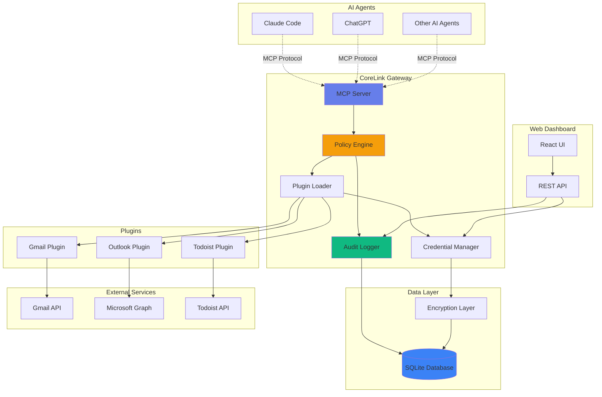
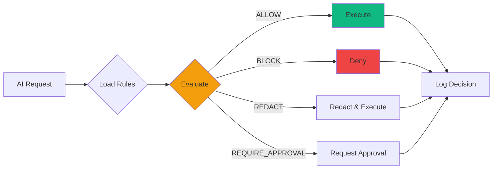
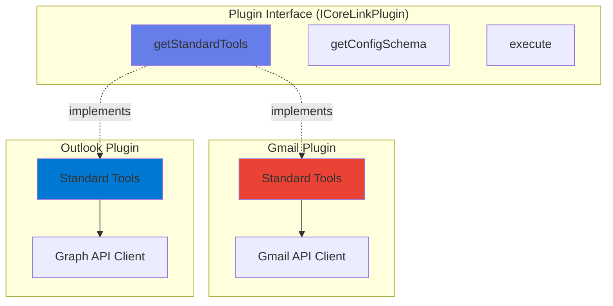
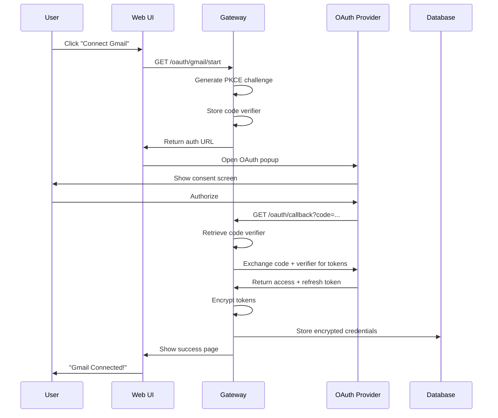
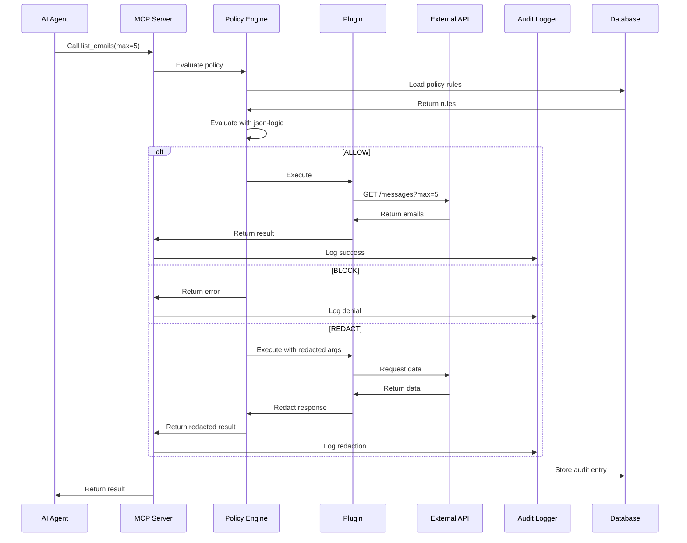
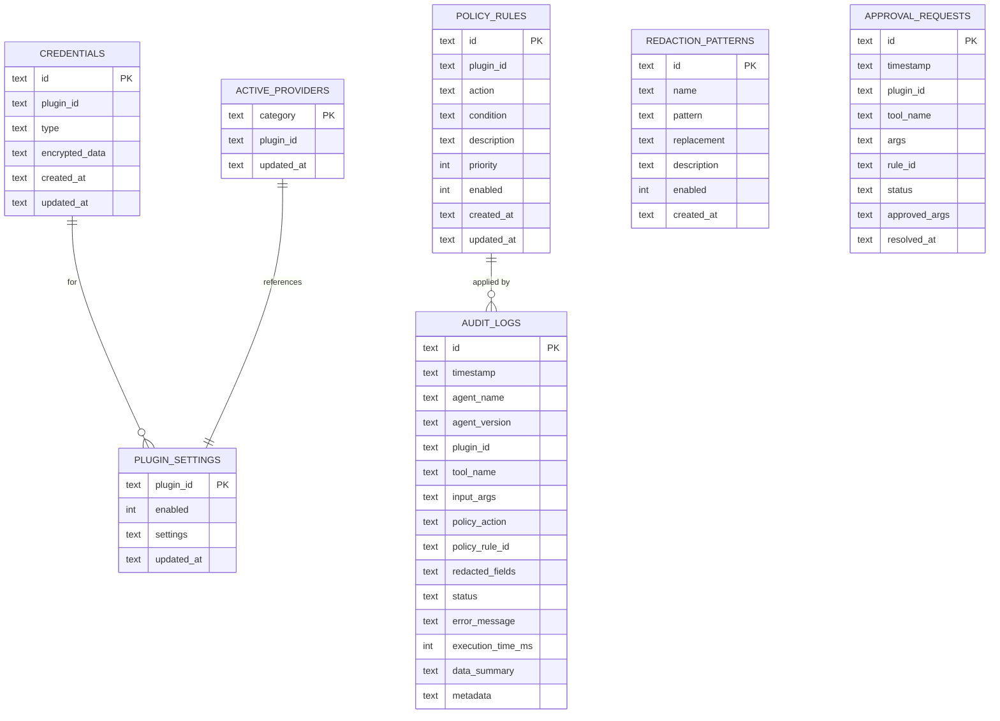

# CoreLink Architecture

**Version**: 0.1.0
**Last Updated**: 2025-02-21
**Status**: Active Development

---

## Table of Contents

1. [Overview](#overview)
2. [System Architecture](#system-architecture)
3. [Component Details](#component-details)
4. [Data Flow](#data-flow)
5. [Database Schema](#database-schema)
6. [Security Model](#security-model)
7. [Plugin System](#plugin-system)
8. [Technology Stack](#technology-stack)

---

## Overview

CoreLink is a **local-first, open-source system** that acts as a secure gateway between AI agents and workspace applications (Gmail, Outlook, Todoist, etc.). It provides:

- **Granular access control** via policy engine
- **Service abstraction** (Gmail and Outlook both implement `list_emails`)
- **Complete audit logging** of all AI actions
- **Privacy-first design** (all data stays local)
- **Extensible plugin architecture**

### Core Principles

1. **Local-First**: All credentials, policies, and audit logs stored locally in SQLite
2. **Zero Trust**: Every AI request evaluated against policy rules
3. **Transparency**: Complete audit trail of all actions
4. **Abstraction**: AI agents work with universal interfaces, not provider-specific APIs
5. **Extensibility**: Easy to add new service plugins

---

## System Architecture



---

## Component Details

### 1. MCP Server (`packages/gateway/src/mcp/`)

**Purpose**: Expose plugin tools to AI agents via Model Context Protocol

**Responsibilities**:
- Register all plugin tools as MCP tools
- Handle tool execution requests from AI agents
- Route requests through Policy Engine
- Return results in MCP format

**Technology**: `@modelcontextprotocol/sdk`

**Status**: ⏳ Not yet implemented

---

### 2. Policy Engine (`packages/gateway/src/services/policy-engine.ts`)

**Purpose**: Evaluate access control rules before allowing AI actions

**Responsibilities**:
- Load policy rules from database
- Evaluate rules using json-logic-js
- Return policy decision: ALLOW / BLOCK / REDACT / REQUIRE_APPROVAL
- Redact sensitive fields based on redaction patterns

**Policy Evaluation Flow**:



**Example Policy**:
```json
{
  "id": "pol-001",
  "action": "ALLOW",
  "condition": {
    "and": [
      {"==": [{"var": "tool"}, "list_emails"]},
      {"<=": [{"var": "args.max_results"}, 10]}
    ]
  },
  "description": "Allow listing up to 10 emails"
}
```

**Status**: ⏳ Not yet implemented

---

### 3. Credential Manager (`packages/gateway/src/services/credential-manager.ts`)

**Purpose**: Securely store and retrieve OAuth tokens

**Responsibilities**:
- Store encrypted OAuth tokens in database
- Retrieve and decrypt credentials for plugin execution
- Update tokens after refresh
- Delete credentials on disconnect

**Encryption**: AES-256-GCM with random IV per credential

**Status**: ✅ Implemented

---

### 4. Audit Logger (`packages/gateway/src/services/audit-logger.ts`)

**Purpose**: Track all AI agent actions for transparency

**Logged Information**:
- Timestamp
- Agent name and version
- Plugin and tool name
- Input arguments
- Policy decision (ALLOW/BLOCK/REDACT)
- Execution result (success/error)
- Execution time
- Redacted fields (if applicable)

**Status**: ⏳ Not yet implemented (schema exists)

---

### 5. Plugin System

**Architecture**:



**Standard Tools** (Service Abstraction):
- `list_emails` - List emails from inbox
- `read_email` - Read specific email
- `send_email` - Send an email
- `search_emails` - Search emails
- `create_task` - Create a task (Todoist, Google Tasks)
- `list_tasks` - List tasks
- `complete_task` - Mark task complete

**Plugin Lifecycle**:
1. Plugin loaded by Plugin Loader
2. Tools registered in MCP Server
3. User connects via OAuth (credentials stored)
4. AI agent calls tool via MCP
5. Request evaluated by Policy Engine
6. Plugin executes if allowed
7. Result logged in Audit Log

**Status**: ✅ Gmail and Outlook plugins implemented

---

### 6. Web Dashboard (`packages/web/`)

**Purpose**: User interface for managing CoreLink

**Pages**:
- **Home** (`/`) - Connection status, connect services
- **Policies** (`/policies`) - Manage access control rules [TODO]
- **Audit Log** (`/audit`) - View AI action history [TODO]
- **Settings** (`/settings`) - Configure CoreLink [TODO]

**Technology**: Vite + React + TypeScript + TailwindCSS

**Status**: ✅ Home page implemented

---

## Data Flow

### OAuth Connection Flow



### AI Tool Execution Flow



---

## Database Schema

### Tables



### Key Relationships

- **CREDENTIALS** stores encrypted OAuth tokens per plugin
- **POLICY_RULES** can be global or plugin-specific
- **AUDIT_LOGS** references the policy rule that was applied
- **ACTIVE_PROVIDERS** maps categories (email, task) to active plugin

---

## Security Model

### Threat Model

**Assets to Protect**:
1. OAuth tokens (access & refresh)
2. Email content
3. Task data
4. Policy configurations

**Threats**:
1. Token theft from database
2. Unauthorized AI access to data
3. Policy bypass
4. Token exfiltration via compromised plugin

### Security Controls

#### 1. Credential Encryption
- **Algorithm**: AES-256-GCM
- **Key Storage**: `.corelink/encryption.key` (600 permissions)
- **IV**: Random per credential
- **Auth Tag**: Verified on decrypt

#### 2. PKCE OAuth Flow
- **No client secret** stored (public Client ID only)
- **Code verifier**: 128 random bytes
- **Code challenge**: SHA-256 hash
- **State parameter**: CSRF protection
- **Verifier storage**: In-memory (expires after 10 minutes)

#### 3. Policy Enforcement
- **Zero trust**: Every request evaluated
- **json-logic-js**: Sandboxed expression evaluation
- **Priority-based**: Higher priority rules evaluated first
- **Default deny**: If no rules match, deny

#### 4. Audit Logging
- **Immutable**: Audit logs cannot be deleted via API
- **Complete**: All requests logged (allowed and denied)
- **Timestamped**: ISO8601 format
- **Redaction tracking**: Which fields were redacted

---

## Plugin System

### Plugin Interface

```typescript
interface ICoreLinkPlugin {
  // Metadata
  readonly id: string;
  readonly name: string;
  readonly version: string;
  readonly category: PluginCategory;
  readonly description: string;

  // Tool definitions
  getStandardTools(): ToolDefinition[];
  getNativeTools?(): ToolDefinition[];

  // Configuration
  getConfigSchema(): Record<string, ConfigField>;

  // Execution
  execute(toolName: string, args: Record<string, unknown>, context: ExecutionContext): Promise<ActionResult>;

  // Lifecycle
  initialize?(context: ExecutionContext): Promise<void>;
  destroy?(): Promise<void>;
}
```

### Plugin Discovery

**Current**: Manual registration in gateway
**Future**: Auto-discovery from `plugins/` directory

### Plugin Development

1. Create plugin package in `plugins/<name>/`
2. Implement `ICoreLinkPlugin` interface
3. Export plugin class as default
4. Add to `package.json` workspaces
5. Register in gateway (currently manual)

Example:
```typescript
export class MyPlugin implements ICoreLinkPlugin {
  readonly id = 'com.example.myplugin';
  readonly name = 'My Plugin';
  readonly version = '1.0.0';
  readonly category = 'email';
  readonly description = 'Example plugin';

  getStandardTools() {
    return [{
      name: 'list_emails',
      description: 'List emails',
      inputSchema: { /* JSON schema */ }
    }];
  }

  async execute(toolName, args, context) {
    // Implementation
  }
}
```

---

## Technology Stack

### Backend

| Component | Technology | Version | Purpose |
|-----------|-----------|---------|---------|
| Runtime | Node.js | 20+ LTS | JavaScript runtime |
| Language | TypeScript | 5.3+ | Type safety |
| Server | Fastify | 4.25+ | HTTP server |
| Database | SQLite | - | Local data storage |
| ORM | Drizzle ORM | 0.29+ | Type-safe database queries |
| Protocol | MCP SDK | 0.5+ | AI agent communication |
| Policy | json-logic-js | 2.0+ | Rule evaluation |
| Crypto | Node.js crypto | Built-in | Encryption |

### Frontend

| Component | Technology | Version | Purpose |
|-----------|-----------|---------|---------|
| Framework | React | 18.2+ | UI framework |
| Build Tool | Vite | 5.0+ | Fast bundler |
| Language | TypeScript | 5.3+ | Type safety |
| Styling | TailwindCSS | 3.4+ | Utility CSS |
| Router | React Router | 6.21+ | Client-side routing |

### Plugins

| Plugin | API | Library | Purpose |
|--------|-----|---------|---------|
| Gmail | Gmail API | googleapis | Email integration |
| Outlook | Microsoft Graph | @microsoft/microsoft-graph-client | Email integration |
| Todoist | Todoist API | @doist/todoist-api-typescript | Task management |

### Development

| Tool | Purpose |
|------|---------|
| ESLint | Linting |
| Prettier | Code formatting |
| Husky | Git hooks |
| lint-staged | Pre-commit formatting |
| Vitest | Unit testing |
| Playwright | E2E testing |
| tsx | TypeScript execution |
| Drizzle Kit | Database migrations |

---

## Design Decisions

### Why SQLite?

✅ **Local-first** - No external database required
✅ **Single file** - Easy backup and migration
✅ **Fast** - Sufficient for single-user workloads
✅ **Zero config** - Works out of the box

### Why PKCE OAuth?

✅ **No secrets** - Client ID is public (safe for open source)
✅ **Industry standard** - Same as GitHub CLI, gcloud
✅ **Secure** - Code challenge prevents token theft
✅ **User-friendly** - No OAuth app setup required

### Why json-logic-js?

✅ **Sandboxed** - Safe expression evaluation
✅ **Flexible** - Complex rules with AND/OR/NOT
✅ **JSON-based** - Easy to store and serialize
✅ **Proven** - Used in many production systems

### Why Fastify over Express?

✅ **Fast** - 2x faster than Express
✅ **TypeScript-first** - Better type support
✅ **Plugin system** - Matches CoreLink architecture
✅ **Schema validation** - Built-in with JSON Schema

### Why Monorepo?

✅ **Shared types** - `@corelink/core` used by all packages
✅ **Atomic changes** - Change core types and plugins together
✅ **Single build** - `npm run build` builds everything
✅ **npm workspaces** - Built-in, no external tools needed

---

## Future Architecture Changes

### V2 Considerations

1. **Multi-user Support**
   - Separate credential storage per user
   - User authentication (passkeys, OAuth)
   - User-specific policies

2. **Cloud Sync (Optional)**
   - Replicate policies to cloud
   - Conflict resolution
   - End-to-end encryption

3. **Plugin Marketplace**
   - Discover and install plugins via UI
   - Plugin versioning
   - Plugin permissions system

4. **Distributed Architecture**
   - Gateway as separate service
   - Web UI as separate service
   - Load balancing for multi-instance

5. **Advanced Policy Engine**
   - Machine learning-based anomaly detection
   - Time-based policies (work hours only)
   - Context-aware policies (location, device)

---

## References

- [MCP Protocol Specification](https://modelcontextprotocol.io/)
- [PKCE RFC 7636](https://www.rfc-editor.org/rfc/rfc7636)
- [OAuth 2.0 for Native Apps](https://developers.google.com/identity/protocols/oauth2/native-app)
- [json-logic Documentation](http://jsonlogic.com/)
- [Drizzle ORM Documentation](https://orm.drizzle.team/)

---

**Maintained by**: CoreLink Team
**Last Review**: 2025-02-21
**Next Review**: 2025-03-21
