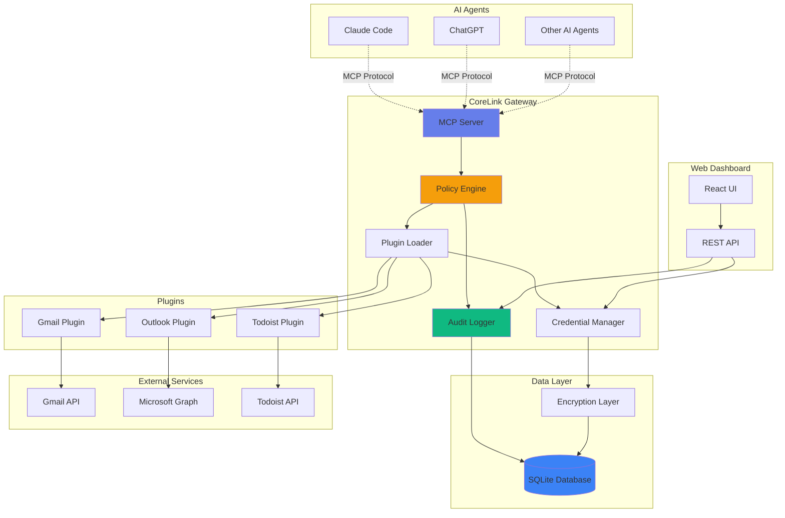
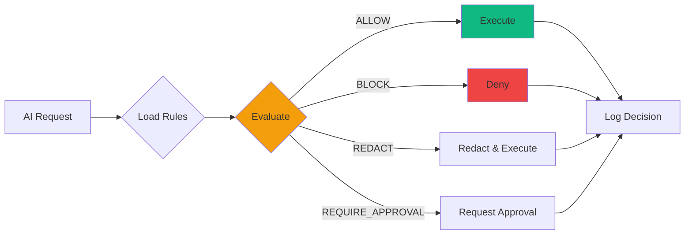
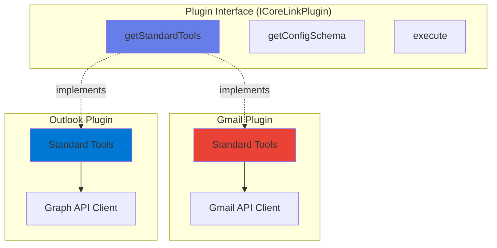
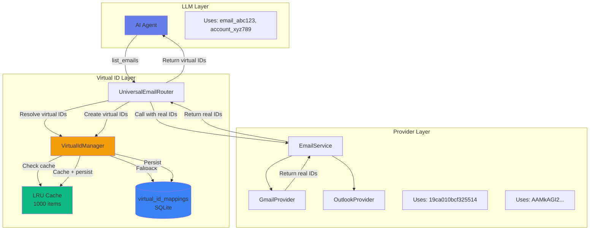
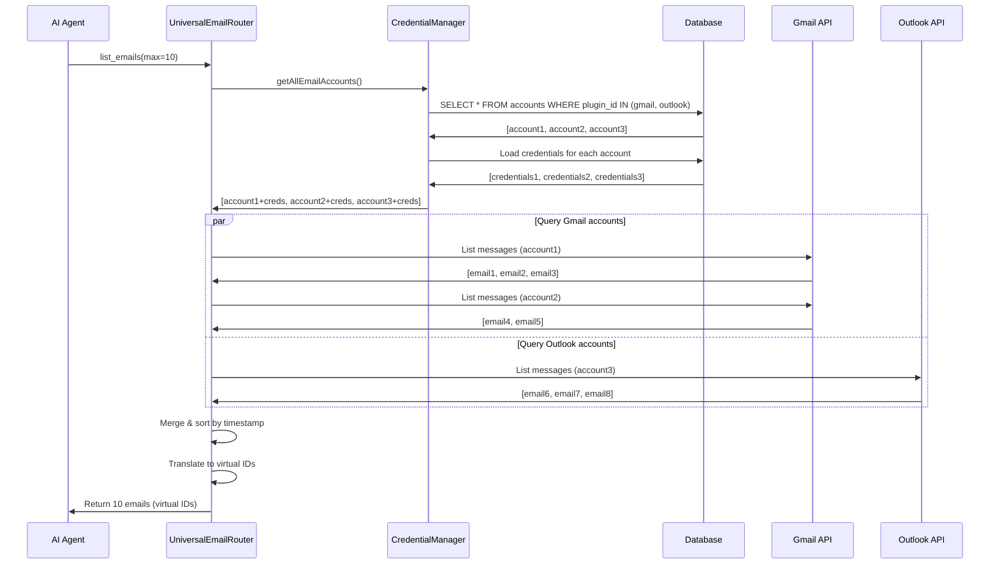
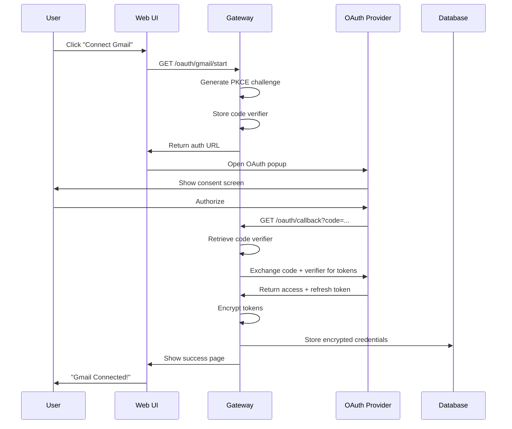
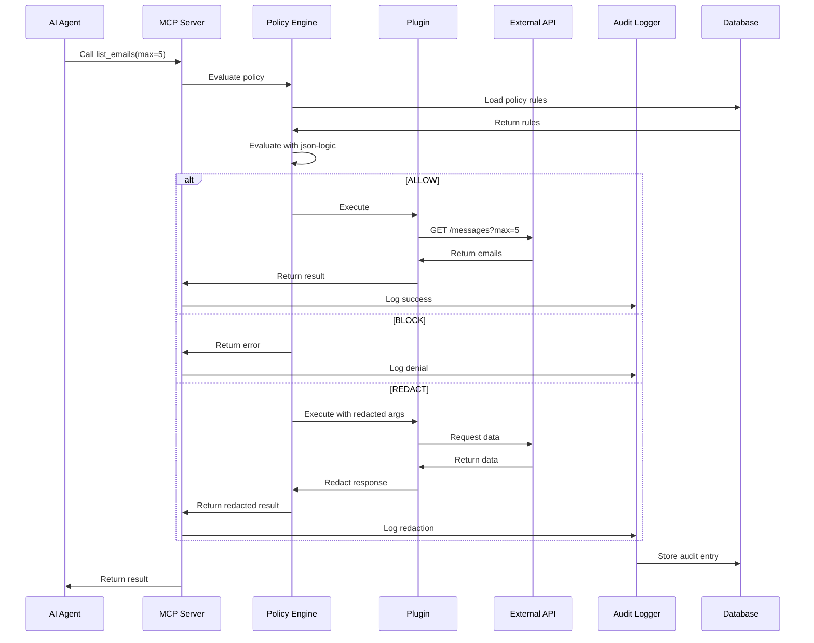
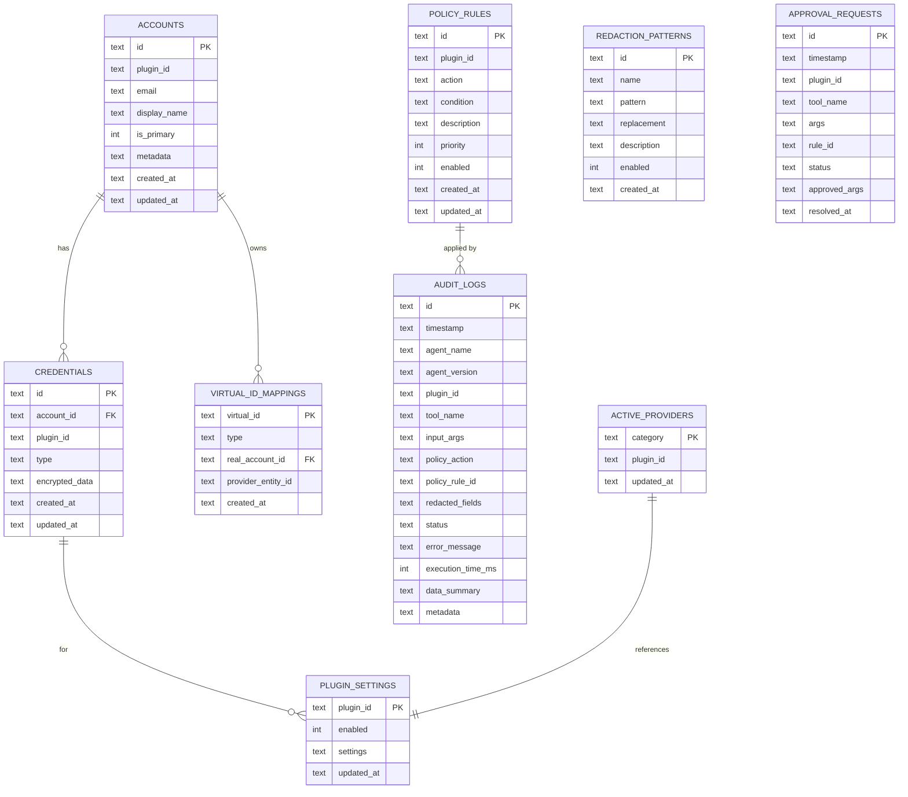

# CoreLink Architecture

**Version**: 0.2.0
**Last Updated**: 2026-02-27
**Status**: Active Development

---

## Table of Contents

1. [Overview](#overview)
2. [System Architecture](#system-architecture)
3. [Component Details](#component-details)
4. [Virtual ID Abstraction](#virtual-id-abstraction)
5. [Multi-Account Architecture](#multi-account-architecture)
6. [Data Flow](#data-flow)
7. [Database Schema](#database-schema)
8. [Security Model](#security-model)
9. [Plugin System](#plugin-system)
10. [Technology Stack](#technology-stack)

---

## Overview

CoreLink is a **local-first, open-source system** that acts as a secure gateway between AI agents and workspace applications (Gmail, Outlook, Todoist, etc.). It provides:

- **Granular access control** via policy engine
- **Complete service abstraction** with virtual ID layer
- **Multi-account support** (connect multiple Gmail/Outlook accounts)
- **Complete audit logging** of all AI actions
- **Privacy-first design** (all data stays local)
- **Extensible plugin architecture**

### Core Principles

1. **Local-First**: All credentials, policies, and audit logs stored locally in SQLite
2. **Zero Trust**: Every AI request evaluated against policy rules
3. **Transparency**: Complete audit trail of all actions
4. **Complete Abstraction**: AI agents never see provider-specific IDs or implementation details
5. **Multi-Account**: Support multiple accounts per provider with seamless aggregation
6. **Extensibility**: Easy to add new service plugins

---

## System Architecture



---

## Component Details

### 1. MCP Server (`packages/gateway/src/mcp/` and `packages/gateway/src/index.ts`)

**Purpose**: Expose universal email tools to AI agents via Model Context Protocol

**Responsibilities**:
- Register universal email tools (list_emails, read_email, send_email, search_emails)
- Handle tool execution requests from AI agents via HTTP or stdio transport
- Route requests through UniversalEmailRouter with virtual ID translation
- Return results in MCP format with virtual IDs

**Technology**: `@modelcontextprotocol/sdk`

**Transports**:
- **HTTP** (`/mcp` endpoint) - For remote AI agents
- **stdio** (`mcp-server.ts`) - For local AI agents like Claude Code

**Status**: ✅ Implemented with virtual ID support

---

### 2. Policy Engine (`packages/gateway/src/services/policy-engine.ts`)

**Purpose**: Evaluate access control rules before allowing AI actions

**Responsibilities**:
- Load policy rules from database
- Evaluate rules using json-logic-js
- Return policy decision: ALLOW / BLOCK / REDACT / REQUIRE_APPROVAL
- Redact sensitive fields based on redaction patterns

**Policy Evaluation Flow**:



**Example Policy**:
```json
{
  "id": "pol-001",
  "action": "ALLOW",
  "condition": {
    "and": [
      {"==": [{"var": "tool"}, "list_emails"]},
      {"<=": [{"var": "args.max_results"}, 10]}
    ]
  },
  "description": "Allow listing up to 10 emails"
}
```

**Status**: ⏳ Not yet implemented

---

### 3. Credential Manager (`packages/gateway/src/services/credential-manager.ts`)

**Purpose**: Securely store and retrieve OAuth tokens with multi-account support

**Responsibilities**:
- Store encrypted OAuth tokens per account in database
- Manage multiple accounts per provider (Gmail, Outlook)
- Set primary account for write operations
- Retrieve and decrypt credentials for plugin execution
- Update tokens after refresh
- Delete credentials on disconnect

**Multi-Account Features**:
- Create and manage multiple accounts per plugin
- Mark accounts as primary for default operations
- Load credentials into account metadata for provider access

**Encryption**: AES-256-GCM with random IV per credential

**Status**: ✅ Implemented with multi-account support

---

### 4. Virtual ID Manager (`packages/gateway/src/services/VirtualIdManager.ts`)

**Purpose**: Provide complete service abstraction by hiding provider-specific IDs from AI agents

**Responsibilities**:
- Generate virtual IDs for emails and accounts
- Resolve virtual IDs to real provider IDs
- Maintain bidirectional mappings (virtual ↔ real)
- Persist mappings across server restarts
- Cache recent mappings for performance

**Virtual ID Format**:
- Email IDs: `email_<12 random chars>` (e.g., `email_iUDaJ8sG3O-K`)
- Account IDs: `account_<12 random chars>` (e.g., `account_bC6SpqtmMXqS`)

**Storage Architecture**:
- **In-Memory LRU Cache**: 1000 most recent mappings (O(1) lookup)
- **SQLite Database**: Persistent storage with indices (O(log n) lookup)
- **UNIQUE Constraints**: Prevent duplicate virtual IDs in concurrent scenarios

**Benefits**:
- **Privacy**: Virtual IDs can't be reverse-engineered without database access
- **Flexibility**: Can change providers without breaking virtual IDs
- **Security**: Real email/account IDs never exposed to LLMs
- **Consistency**: Same real ID always maps to same virtual ID

**Status**: ✅ Implemented

---

### 5. Universal Email Router (`packages/gateway/src/services/email/UniversalEmailRouter.ts`)

**Purpose**: Route MCP tool calls to EmailService with automatic virtual ID translation

**Responsibilities**:
- Implement universal email tools (list, read, send, search)
- Translate real IDs → virtual IDs (for LLM responses)
- Resolve virtual IDs → real IDs (for provider requests)
- Aggregate results from multiple accounts (for list/search)
- Load credentials into account metadata

**Tool Implementation**:
- `listEmails()` - Aggregates ALL accounts, returns virtual IDs
- `readEmail()` - Resolves virtual email ID, fetches from provider
- `sendEmail()` - Uses primary account or specified virtual account ID
- `searchEmails()` - Searches ALL accounts, returns virtual IDs

**Architecture**:
```
LLM Request (virtual IDs)
       ↓
UniversalEmailRouter
       ↓
Resolve virtual → real IDs
       ↓
EmailService (real IDs)
       ↓
Provider (Gmail/Outlook)
       ↓
Translate real → virtual IDs
       ↓
LLM Response (virtual IDs)
```

**Status**: ✅ Implemented

---

### 6. Audit Logger (`packages/gateway/src/services/audit-logger.ts`)

**Purpose**: Track all AI agent actions for transparency

**Logged Information**:
- Timestamp
- Agent name and version
- Plugin and tool name
- Input arguments
- Policy decision (ALLOW/BLOCK/REDACT)
- Execution result (success/error)
- Execution time
- Redacted fields (if applicable)

**Status**: ⏳ Not yet implemented (schema exists)

---

### 7. Plugin System

**Architecture**:



**Standard Tools** (Service Abstraction):
- `list_emails` - List emails from inbox
- `read_email` - Read specific email
- `send_email` - Send an email
- `search_emails` - Search emails
- `create_task` - Create a task (Todoist, Google Tasks)
- `list_tasks` - List tasks
- `complete_task` - Mark task complete

**Plugin Lifecycle**:
1. Plugin loaded by Plugin Loader
2. Tools registered in MCP Server
3. User connects via OAuth (credentials stored)
4. AI agent calls tool via MCP
5. Request evaluated by Policy Engine
6. Plugin executes if allowed
7. Result logged in Audit Log

**Status**: ✅ Gmail and Outlook plugins implemented

---

### 8. Web Dashboard (`packages/web/`)

**Purpose**: User interface for managing CoreLink

**Pages**:
- **Home** (`/`) - Connection status, connect services
- **Policies** (`/policies`) - Manage access control rules [TODO]
- **Audit Log** (`/audit`) - View AI action history [TODO]
- **Settings** (`/settings`) - Configure CoreLink [TODO]

**Technology**: Vite + React + TypeScript + TailwindCSS

**Status**: ✅ Home page implemented

---

## Virtual ID Abstraction

### Overview

The Virtual ID system provides **complete service abstraction** by ensuring AI agents never see provider-specific implementation details (Gmail message IDs, Outlook IDs, account UUIDs, etc.). Instead, all entities are represented by randomly-generated virtual IDs.

### Why Virtual IDs?

**Without Virtual IDs**:
```json
{
  "id": "19ca010bcf325514",  // Gmail-specific message ID
  "accountId": "550e8400-e29b-41d4-a716-446655440000",  // UUID
  "providerId": "com.corelink.gmail"  // Leaks provider info
}
```

**With Virtual IDs**:
```json
{
  "id": "email_iUDaJ8sG3O-K",  // Provider-agnostic virtual ID
  "accountId": "account_bC6SpqtmMXqS"  // Virtual account ID
  // No providerId field - complete abstraction!
}
```

### Benefits

1. **Complete Privacy**: Real IDs never exposed to LLMs
2. **Provider Flexibility**: Can switch providers without breaking virtual IDs
3. **Security**: Virtual IDs can't be reverse-engineered without database access
4. **Consistency**: Same real ID always maps to same virtual ID (deterministic)
5. **Audit Trail**: Virtual IDs tracked in audit logs, not real IDs

### Architecture



### Virtual ID Format

- **Email IDs**: `email_<12 random chars>` using nanoid
  - Example: `email_iUDaJ8sG3O-K`
  - Character set: `0-9A-Za-z_-` (URL-safe)
  - Collision probability: ~1 in 10^21 for 12 chars

- **Account IDs**: `account_<12 random chars>` using nanoid
  - Example: `account_bC6SpqtmMXqS`
  - Same character set and collision resistance

### Storage Strategy

**Hybrid Storage**:
1. **LRU Cache** (in-memory)
   - Stores 1000 most recent mappings
   - O(1) lookup for cached items
   - Proper LRU implementation (move-to-end on access)
   - Cleared on server restart

2. **SQLite Database** (persistent)
   - Stores ALL mappings
   - O(log n) lookup with indices
   - Survives server restarts
   - UNIQUE constraints prevent duplicates

**Database Schema**:
```sql
CREATE TABLE virtual_id_mappings (
  virtual_id TEXT PRIMARY KEY,
  type TEXT NOT NULL,  -- 'email' or 'account'
  real_account_id TEXT NOT NULL,
  provider_entity_id TEXT,  -- NULL for account type
  created_at TEXT NOT NULL
);

-- Performance indices
CREATE UNIQUE INDEX idx_email_reverse
  ON virtual_id_mappings(type, real_account_id, provider_entity_id)
  WHERE type = 'email' AND provider_entity_id IS NOT NULL;

CREATE UNIQUE INDEX idx_account_reverse
  ON virtual_id_mappings(type, real_account_id)
  WHERE type = 'account';

CREATE INDEX idx_virtual_type
  ON virtual_id_mappings(virtual_id, type);
```

### Virtual ID Lifecycle

1. **Creation** (e.g., listing emails):
   ```typescript
   // Check cache first
   if (cached) return cachedVirtualId;

   // Generate new virtual ID
   const virtualId = `email_${nanoid(12)}`;

   // Try to insert (may fail if another thread created it)
   try {
     await db.insert({ virtualId, realAccountId, providerEmailId });
     cache(virtualId);
     return virtualId;
   } catch (UniqueConstraintError) {
     // Another thread won - fetch their virtual ID
     const existing = await db.query(...);
     cache(existing.virtualId);
     return existing.virtualId;
   }
   ```

2. **Resolution** (e.g., reading email):
   ```typescript
   // Check cache first
   if (cached) return { accountId, emailId };

   // Query database
   const mapping = await db.query(virtualId);
   cache(mapping);
   return { accountId: mapping.realAccountId, emailId: mapping.providerEntityId };
   ```

3. **Caching**: LRU with move-to-end on access
   ```typescript
   // On cache hit, move to end (most recently used)
   const value = cache.get(key);
   if (value) {
     cache.delete(key);  // Remove from current position
     cache.set(key, value);  // Add to end (most recent)
   }
   ```

### Race Condition Prevention

**Problem**: Two concurrent requests for same email create different virtual IDs

**Solution**: UNIQUE database constraints
```sql
CREATE UNIQUE INDEX idx_email_reverse
  ON virtual_id_mappings(type, real_account_id, provider_entity_id)
  WHERE type = 'email' AND provider_entity_id IS NOT NULL;
```

**Flow**:
1. Thread A generates `email_abc123`, tries to insert
2. Thread B generates `email_xyz789`, tries to insert
3. One succeeds (e.g., Thread A), other gets constraint error
4. Thread B catches error, queries for Thread A's virtual ID
5. Both threads return `email_abc123` (deterministic!)

---

## Multi-Account Architecture

### Overview

CoreLink supports **multiple accounts per provider**, allowing users to connect multiple Gmail accounts, multiple Outlook accounts, etc. AI agents can access emails from all connected accounts seamlessly.

### Account Management

**Database Schema**:
```sql
CREATE TABLE accounts (
  id TEXT PRIMARY KEY,  -- UUID
  plugin_id TEXT NOT NULL,  -- e.g., 'com.corelink.gmail'
  email TEXT NOT NULL,  -- user@example.com
  display_name TEXT,
  is_primary INTEGER NOT NULL DEFAULT 0,
  metadata TEXT,  -- JSON metadata
  created_at TEXT NOT NULL,
  updated_at TEXT NOT NULL
);

CREATE TABLE credentials (
  id TEXT PRIMARY KEY,
  account_id TEXT REFERENCES accounts(id),
  plugin_id TEXT NOT NULL,
  type TEXT NOT NULL,  -- 'oauth2'
  encrypted_data TEXT NOT NULL,  -- AES-256-GCM encrypted tokens
  created_at TEXT NOT NULL,
  updated_at TEXT NOT NULL
);
```

### Primary Account Concept

- **Read Operations**: Aggregate ALL accounts
  - `list_emails` returns emails from all Gmail + Outlook accounts
  - `search_emails` searches across all accounts

- **Write Operations**: Use primary account by default
  - `send_email` defaults to primary account
  - Can specify virtual account ID to use specific account

**Setting Primary Account**:
```typescript
// First account added is automatically primary
await credentialManager.createAccount('com.corelink.gmail', 'user1@gmail.com');
// is_primary = true

// Second account is not primary
await credentialManager.createAccount('com.corelink.gmail', 'user2@gmail.com');
// is_primary = false

// Change primary account
await credentialManager.setPrimaryAccount(secondAccountId);
// user2 is now primary, user1 is not
```

### Multi-Account Tool Behavior

**list_emails**:
```typescript
// AI Agent request
list_emails({ max_results: 10 })

// CoreLink behavior
1. Get ALL email accounts (Gmail + Outlook)
2. Query each provider in parallel
3. Merge results sorted by timestamp
4. Translate to virtual IDs
5. Return aggregated results with virtual account IDs
```

**send_email**:
```typescript
// AI Agent request (no account specified)
send_email({ to: 'friend@example.com', subject: 'Hi', body: 'Hello' })
// Uses primary account

// AI Agent request (account specified)
send_email({
  account_id: 'account_xyz789',  // Virtual account ID
  to: 'friend@example.com',
  subject: 'Hi',
  body: 'Hello'
})
// Uses specified account (resolved from virtual ID)
```

### Account Discovery Flow



### Credential Loading

**Challenge**: Credentials stored separately from accounts

**Solution**: Load credentials into account metadata
```typescript
async getAllEmailAccounts(): Promise<Account[]> {
  const accounts = await credentialManager.listAccounts();

  // Load credentials for each account
  const accountsWithCredentials = await Promise.all(
    accounts.map(async account => {
      const credentials = await credentialManager.getAccountCredentials(account.id);
      return {
        ...account,
        metadata: {
          ...account.metadata,
          ...credentials.data  // Merge OAuth tokens into metadata
        }
      };
    })
  );

  return accountsWithCredentials;
}
```

**Provider Access**:
```typescript
// GmailProvider expects tokens in account.metadata
private getGmailClient(account: Account): gmail_v1.Gmail {
  const oauth2Client = new google.auth.OAuth2(
    account.metadata.clientId,
    account.metadata.clientSecret,
    account.metadata.redirectUri
  );

  oauth2Client.setCredentials({
    access_token: account.metadata.accessToken,
    refresh_token: account.metadata.refreshToken,
    expiry_date: account.metadata.expiryDate,
  });

  return google.gmail({ version: 'v1', auth: oauth2Client });
}
```

---

## Data Flow

### OAuth Connection Flow



### AI Tool Execution Flow



---

## Database Schema

### Tables



### Key Relationships

- **ACCOUNTS** stores account information (email, display name, primary flag)
- **CREDENTIALS** stores encrypted OAuth tokens per account (1:1 relationship)
- **VIRTUAL_ID_MAPPINGS** maps virtual IDs to real account + entity IDs
- **POLICY_RULES** can be global or plugin-specific
- **AUDIT_LOGS** references the policy rule that was applied
- **ACTIVE_PROVIDERS** maps categories (email, task) to active plugin

### New Tables (Phase 5.5)

**ACCOUNTS**: Multi-account support
- Stores multiple accounts per provider
- `is_primary` flag indicates default account for write operations
- `metadata` stores provider-specific configuration (OAuth client ID, redirect URI)

**VIRTUAL_ID_MAPPINGS**: Virtual ID abstraction
- Maps virtual IDs (exposed to LLMs) to real IDs (used by providers)
- `type` is 'email' or 'account'
- `provider_entity_id` is NULL for account mappings
- UNIQUE indices prevent duplicate mappings and enable fast reverse lookups

---

## Security Model

### Threat Model

**Assets to Protect**:
1. OAuth tokens (access & refresh)
2. Email content and metadata
3. Real provider-specific IDs (Gmail message IDs, account UUIDs)
4. Task data
5. Policy configurations

**Threats**:
1. Token theft from database
2. Unauthorized AI access to data
3. Policy bypass
4. Token exfiltration via compromised plugin
5. Real ID exposure to LLMs (information leakage)
6. Provider fingerprinting via IDs

### Security Controls

#### 1. Credential Encryption
- **Algorithm**: AES-256-GCM
- **Key Storage**: `.corelink/encryption.key` (600 permissions)
- **IV**: Random per credential
- **Auth Tag**: Verified on decrypt

#### 2. PKCE OAuth Flow
- **No client secret** stored (public Client ID only)
- **Code verifier**: 128 random bytes
- **Code challenge**: SHA-256 hash
- **State parameter**: CSRF protection
- **Verifier storage**: In-memory (expires after 10 minutes)

#### 3. Policy Enforcement
- **Zero trust**: Every request evaluated
- **json-logic-js**: Sandboxed expression evaluation
- **Priority-based**: Higher priority rules evaluated first
- **Default deny**: If no rules match, deny

#### 4. Virtual ID Abstraction
- **No real IDs exposed**: LLMs never see Gmail/Outlook message IDs or account UUIDs
- **Random virtual IDs**: Generated using nanoid (12 chars, URL-safe)
- **Non-reversible**: Virtual IDs can't be reverse-engineered without database
- **Provider-agnostic**: No indication which provider (Gmail vs Outlook) owns the email
- **Deterministic mapping**: Same real ID always maps to same virtual ID
- **Race-safe**: UNIQUE constraints prevent duplicate virtual IDs

#### 5. Audit Logging
- **Immutable**: Audit logs cannot be deleted via API
- **Complete**: All requests logged (allowed and denied)
- **Timestamped**: ISO8601 format
- **Redaction tracking**: Which fields were redacted
- **Virtual IDs**: Logs use virtual IDs, not real IDs (additional privacy layer)

---

## Plugin System

### Plugin Interface

```typescript
interface ICoreLinkPlugin {
  // Metadata
  readonly id: string;
  readonly name: string;
  readonly version: string;
  readonly category: PluginCategory;
  readonly description: string;

  // Tool definitions
  getStandardTools(): ToolDefinition[];
  getNativeTools?(): ToolDefinition[];

  // Configuration
  getConfigSchema(): Record<string, ConfigField>;

  // Execution
  execute(toolName: string, args: Record<string, unknown>, context: ExecutionContext): Promise<ActionResult>;

  // Lifecycle
  initialize?(context: ExecutionContext): Promise<void>;
  destroy?(): Promise<void>;
}
```

### Plugin Discovery

**Current**: Manual registration in gateway
**Future**: Auto-discovery from `plugins/` directory

### Plugin Development

1. Create plugin package in `plugins/<name>/`
2. Implement `ICoreLinkPlugin` interface
3. Export plugin class as default
4. Add to `package.json` workspaces
5. Register in gateway (currently manual)

Example:
```typescript
export class MyPlugin implements ICoreLinkPlugin {
  readonly id = 'com.example.myplugin';
  readonly name = 'My Plugin';
  readonly version = '1.0.0';
  readonly category = 'email';
  readonly description = 'Example plugin';

  getStandardTools() {
    return [{
      name: 'list_emails',
      description: 'List emails',
      inputSchema: { /* JSON schema */ }
    }];
  }

  async execute(toolName, args, context) {
    // Implementation
  }
}
```

---

## Technology Stack

### Backend

| Component | Technology | Version | Purpose |
|-----------|-----------|---------|---------|
| Runtime | Node.js | 20+ LTS | JavaScript runtime |
| Language | TypeScript | 5.3+ | Type safety |
| Server | Fastify | 4.25+ | HTTP server |
| Database | SQLite | - | Local data storage |
| ORM | Drizzle ORM | 0.29+ | Type-safe database queries |
| Protocol | MCP SDK | 0.5+ | AI agent communication |
| Policy | json-logic-js | 2.0+ | Rule evaluation |
| Crypto | Node.js crypto | Built-in | Encryption |
| Virtual IDs | nanoid | 5.1+ | Random ID generation |

### Frontend

| Component | Technology | Version | Purpose |
|-----------|-----------|---------|---------|
| Framework | React | 18.2+ | UI framework |
| Build Tool | Vite | 5.0+ | Fast bundler |
| Language | TypeScript | 5.3+ | Type safety |
| Styling | TailwindCSS | 3.4+ | Utility CSS |
| Router | React Router | 6.21+ | Client-side routing |

### Plugins

| Plugin | API | Library | Purpose |
|--------|-----|---------|---------|
| Gmail | Gmail API | googleapis | Email integration |
| Outlook | Microsoft Graph | @microsoft/microsoft-graph-client | Email integration |
| Todoist | Todoist API | @doist/todoist-api-typescript | Task management |

### Development

| Tool | Purpose |
|------|---------|
| ESLint | Linting |
| Prettier | Code formatting |
| Husky | Git hooks |
| lint-staged | Pre-commit formatting |
| Vitest | Unit testing |
| Playwright | E2E testing |
| tsx | TypeScript execution |
| Drizzle Kit | Database migrations |

---

## Design Decisions

### Why SQLite?

✅ **Local-first** - No external database required
✅ **Single file** - Easy backup and migration
✅ **Fast** - Sufficient for single-user workloads
✅ **Zero config** - Works out of the box

### Why PKCE OAuth?

✅ **No secrets** - Client ID is public (safe for open source)
✅ **Industry standard** - Same as GitHub CLI, gcloud
✅ **Secure** - Code challenge prevents token theft
✅ **User-friendly** - No OAuth app setup required

### Why json-logic-js?

✅ **Sandboxed** - Safe expression evaluation
✅ **Flexible** - Complex rules with AND/OR/NOT
✅ **JSON-based** - Easy to store and serialize
✅ **Proven** - Used in many production systems

### Why Fastify over Express?

✅ **Fast** - 2x faster than Express
✅ **TypeScript-first** - Better type support
✅ **Plugin system** - Matches CoreLink architecture
✅ **Schema validation** - Built-in with JSON Schema

### Why Monorepo?

✅ **Shared types** - `@corelink/core` used by all packages
✅ **Atomic changes** - Change core types and plugins together
✅ **Single build** - `npm run build` builds everything
✅ **npm workspaces** - Built-in, no external tools needed

---

## Future Architecture Changes

### V2 Considerations

1. **Multi-user Support**
   - Separate credential storage per user
   - User authentication (passkeys, OAuth)
   - User-specific policies

2. **Cloud Sync (Optional)**
   - Replicate policies to cloud
   - Conflict resolution
   - End-to-end encryption

3. **Plugin Marketplace**
   - Discover and install plugins via UI
   - Plugin versioning
   - Plugin permissions system

4. **Distributed Architecture**
   - Gateway as separate service
   - Web UI as separate service
   - Load balancing for multi-instance

5. **Advanced Policy Engine**
   - Machine learning-based anomaly detection
   - Time-based policies (work hours only)
   - Context-aware policies (location, device)

---

## References

- [MCP Protocol Specification](https://modelcontextprotocol.io/)
- [PKCE RFC 7636](https://www.rfc-editor.org/rfc/rfc7636)
- [OAuth 2.0 for Native Apps](https://developers.google.com/identity/protocols/oauth2/native-app)
- [json-logic Documentation](http://jsonlogic.com/)
- [Drizzle ORM Documentation](https://orm.drizzle.team/)

---

**Maintained by**: CoreLink Team
**Last Review**: 2026-02-27
**Next Review**: 2026-03-27
