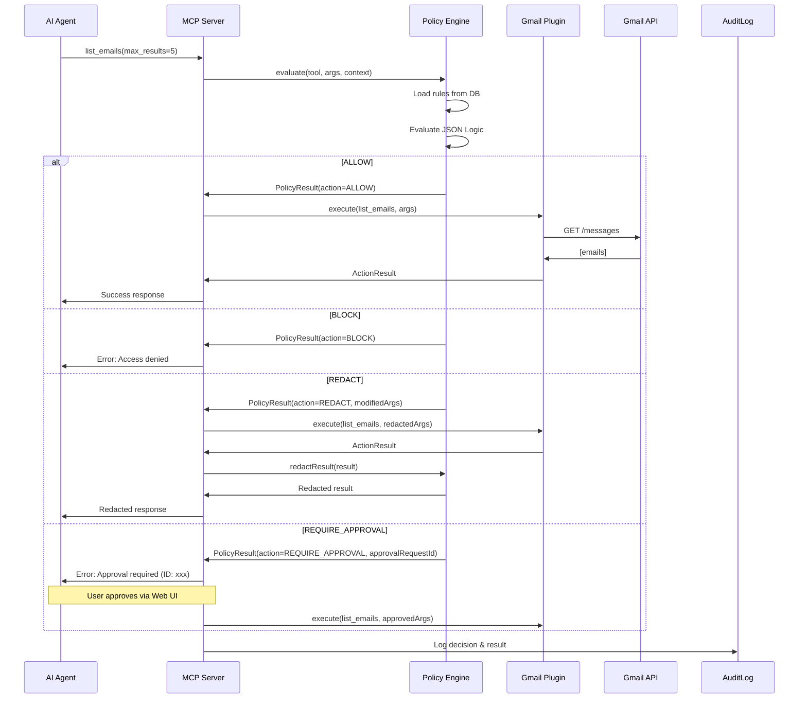

# CoreLink Policy Engine Guide

**Last Updated**: 2025-02-22
**Version**: 0.1.0

---

## Table of Contents

1. [Overview](#overview)
2. [Policy Actions](#policy-actions)
3. [JSON Logic Basics](#json-logic-basics)
4. [Policy Examples](#policy-examples)
5. [Redaction Patterns](#redaction-patterns)
6. [Approval Workflow](#approval-workflow)
7. [API Reference](#api-reference)
8. [Best Practices](#best-practices)

---

## Overview

The CoreLink Policy Engine provides granular access control for AI agents accessing your workspace applications. Every tool execution request is evaluated against a set of policy rules before being executed.

### How It Works



### Key Features

- **Zero Trust**: Every request is evaluated, no implicit allows
- **Priority-Based**: Higher priority rules evaluated first
- **Composable**: Global rules + plugin-specific rules
- **Auditable**: Every decision logged with full context
- **Flexible**: JSON Logic allows complex conditions

---

## Policy Actions

### 1. ALLOW

**Description**: Execute the request normally without modification.

**Use Cases**:
- Permit read-only operations (list, search, read)
- Allow operations within defined limits
- Whitelist specific tools

**Example**:
```json
{
  "id": "pol-allow-read-10",
  "action": "ALLOW",
  "condition": {
    "and": [
      {"==": [{"var": "tool"}, "list_emails"]},
      {"<=": [{"var": "args.max_results"}, 10]}
    ]
  },
  "description": "Allow listing up to 10 emails",
  "priority": 100
}
```

---

### 2. BLOCK

**Description**: Deny the request immediately with an error message.

**Use Cases**:
- Block write operations (send, delete, update)
- Prevent access to sensitive tools
- Enforce organizational policies

**Example**:
```json
{
  "id": "pol-block-send",
  "action": "BLOCK",
  "condition": {
    "==": [{"var": "tool"}, "send_email"]
  },
  "description": "Block all email sending for safety",
  "priority": 200
}
```

**Response to AI Agent**:
```
Access Denied: Block all email sending for safety
```

---

### 3. REDACT

**Description**: Execute the request but redact sensitive information from inputs and/or outputs.

**Use Cases**:
- Remove PII (emails, phone numbers, SSNs)
- Strip sensitive content from emails
- Anonymize data before processing

**Example**:
```json
{
  "id": "pol-redact-body",
  "action": "REDACT",
  "condition": {
    "==": [{"var": "tool"}, "read_email"]
  },
  "description": "Redact sensitive info from email bodies",
  "priority": 100
}
```

**Redaction Process**:
1. Apply regex patterns to input args (modifiedArgs)
2. Execute tool with potentially redacted args
3. Apply regex patterns to output result
4. Log all redacted fields in audit log

---

### 4. REQUIRE_APPROVAL

**Description**: Pause execution and create an approval request for the user.

**Use Cases**:
- High-impact operations (bulk actions)
- First-time access to new tools
- Operations outside normal parameters

**Example**:
```json
{
  "id": "pol-approve-bulk",
  "action": "REQUIRE_APPROVAL",
  "condition": {
    "and": [
      {"==": [{"var": "tool"}, "list_emails"]},
      {">": [{"var": "args.max_results"}, 100]}
    ]
  },
  "description": "Require approval for bulk email access",
  "priority": 150
}
```

**Approval Workflow**:
1. Policy Engine creates approval request in DB
2. AI agent receives error with approval request ID
3. User views request in Web UI
4. User can:
   - Approve as-is
   - Approve with modified arguments
   - Deny the request
5. If approved, execution continues with approved args

---

## JSON Logic Basics

CoreLink uses [json-logic-js](https://github.com/jwadhams/json-logic-js) for policy conditions. JSON Logic provides a declarative, serializable way to express complex boolean logic.

### Evaluation Context

Every request provides the following context variables:

```typescript
{
  tool: string;           // e.g., "list_emails"
  plugin: string;         // e.g., "com.corelink.gmail"
  agent: string;          // e.g., "Claude Code"
  agentVersion?: string;  // e.g., "1.2.0"
  args: Record<string, unknown>;  // Tool arguments
  category?: string;      // e.g., "email"
}
```

### Common Operators

#### Comparison

```json
{"==": [{"var": "tool"}, "list_emails"]}       // Equal
{"!=": [{"var": "tool"}, "send_email"]}        // Not equal
{">":  [{"var": "args.max_results"}, 10]}      // Greater than
{">=": [{"var": "args.max_results"}, 10]}      // Greater or equal
{"<":  [{"var": "args.max_results"}, 100]}     // Less than
{"<=": [{"var": "args.max_results"}, 100]}     // Less or equal
```

#### Logical

```json
{"and": [
  {"==": [{"var": "tool"}, "list_emails"]},
  {"<=": [{"var": "args.max_results"}, 10]}
]}

{"or": [
  {"==": [{"var": "tool"}, "list_emails"]},
  {"==": [{"var": "tool"}, "search_emails"]}
]}

{"!": {"==": [{"var": "tool"}, "send_email"]}}  // NOT
```

#### String Matching

```json
{"in": ["email", {"var": "tool"}]}              // Contains substring
{"startsWith": [{"var": "tool"}, "list"]}       // (not built-in, use custom)
```

#### Arrays

```json
{"in": [{"var": "tool"}, ["list_emails", "search_emails"]]}  // Tool in array
```

---

## Policy Examples

### Example 1: Read-Only Gmail Access

**Goal**: Allow reading and searching emails, but block sending

```json
[
  {
    "id": "pol-gmail-read-only-1",
    "pluginId": "com.corelink.gmail",
    "action": "ALLOW",
    "condition": {
      "or": [
        {"==": [{"var": "tool"}, "list_emails"]},
        {"==": [{"var": "tool"}, "search_emails"]},
        {"==": [{"var": "tool"}, "read_email"]}
      ]
    },
    "priority": 100
  },
  {
    "id": "pol-gmail-read-only-2",
    "pluginId": "com.corelink.gmail",
    "action": "BLOCK",
    "condition": {
      "==": [{"var": "tool"}, "send_email"]
    },
    "priority": 200
  }
]
```

---

### Example 2: Rate-Limited Email Access

**Goal**: Allow up to 10 emails at a time, require approval for more

```json
[
  {
    "id": "pol-rate-limit-1",
    "action": "ALLOW",
    "condition": {
      "and": [
        {"==": [{"var": "tool"}, "list_emails"]},
        {"<=": [{"var": "args.max_results"}, 10]}
      ]
    },
    "priority": 100
  },
  {
    "id": "pol-rate-limit-2",
    "action": "REQUIRE_APPROVAL",
    "condition": {
      "and": [
        {"==": [{"var": "tool"}, "list_emails"]},
        {">": [{"var": "args.max_results"}, 10]},
        {"<=": [{"var": "args.max_results"}, 100]}
      ]
    },
    "priority": 150
  },
  {
    "id": "pol-rate-limit-3",
    "action": "BLOCK",
    "condition": {
      "and": [
        {"==": [{"var": "tool"}, "list_emails"]},
        {">": [{"var": "args.max_results"}, 100]}
      ]
    },
    "priority": 200
  }
]
```

---

### Example 3: Agent-Specific Policies

**Goal**: Different rules for different AI agents

```json
[
  {
    "id": "pol-claude-trusted",
    "action": "ALLOW",
    "condition": {
      "and": [
        {"==": [{"var": "agent"}, "Claude Code"]},
        {"<=": [{"var": "args.max_results"}, 50]}
      ]
    },
    "priority": 100
  },
  {
    "id": "pol-chatgpt-restricted",
    "action": "REQUIRE_APPROVAL",
    "condition": {
      "and": [
        {"==": [{"var": "agent"}, "ChatGPT"]},
        {">": [{"var": "args.max_results"}, 10]}
      ]
    },
    "priority": 100
  }
]
```

---

### Example 4: Time-Based Access

**Goal**: Block operations outside business hours (requires custom variable)

```json
{
  "id": "pol-business-hours",
  "action": "BLOCK",
  "condition": {
    "or": [
      {"<": [{"var": "metadata.hour"}, 9]},
      {">": [{"var": "metadata.hour"}, 17]}
    ]
  },
  "description": "Block access outside 9 AM - 5 PM",
  "priority": 200
}
```

---

## Redaction Patterns

Redaction patterns use regex to find and replace sensitive information in text fields.

### Default Patterns

CoreLink ships with these patterns (disabled by default):

| Pattern | Regex | Replacement | Description |
|---------|-------|-------------|-------------|
| Email Addresses | `[a-zA-Z0-9._%+-]+@[a-zA-Z0-9.-]+\.[a-zA-Z]{2,}` | `[EMAIL_REDACTED]` | Redact email addresses |
| US Phone Numbers | `\b\d{3}[-.]?\d{3}[-.]?\d{4}\b` | `[PHONE_REDACTED]` | Redact phone numbers |
| SSNs | `\b\d{3}-\d{2}-\d{4}\b` | `[SSN_REDACTED]` | Redact Social Security Numbers |
| Credit Cards | `\b\d{4}[\s-]?\d{4}[\s-]?\d{4}[\s-]?\d{4}\b` | `[CARD_REDACTED]` | Redact credit card numbers |
| API Keys | `\b[a-zA-Z0-9]{32,}\b` | `[API_KEY_REDACTED]` | Redact potential API keys |
| Bearer Tokens | `Bearer\s+[a-zA-Z0-9._-]+` | `Bearer [TOKEN_REDACTED]` | Redact Bearer tokens |

### Creating Custom Patterns

**Via API**:
```bash
POST /api/redaction-patterns
Content-Type: application/json

{
  "name": "Employee IDs",
  "pattern": "EMP-\\d{6}",
  "replacement": "[EMPLOYEE_ID_REDACTED]",
  "description": "Redact employee ID numbers",
  "enabled": true
}
```

### Redaction Behavior

- Applied to **all string fields** recursively
- Works on both input args and output results
- Tracks which fields were redacted in audit log
- Original data never stored (only redacted version logged)

---

## Approval Workflow

### Creating Approval Requests

When a policy with `REQUIRE_APPROVAL` action matches:

1. Policy Engine creates `ApprovalRequest` record:
   ```typescript
   {
     id: "req-abc123",
     timestamp: "2025-02-22T10:30:00Z",
     pluginId: "com.corelink.gmail",
     toolName: "list_emails",
     args: { max_results: 150 },
     ruleId: "pol-approve-bulk",
     status: "pending"
   }
   ```

2. AI agent receives error response:
   ```
   Approval Required: Require approval for bulk email access

   Approval Request ID: req-abc123

   Please approve this request via the CoreLink web dashboard.
   ```

### Approving Requests

**Via Web UI**:
1. Navigate to `/approvals` page
2. View pending requests
3. Review tool, args, and policy reason
4. Optionally modify arguments
5. Click "Approve" or "Deny"

**Via API**:
```bash
POST /api/approval-requests/req-abc123/approve
Content-Type: application/json

{
  "approvedArgs": {
    "max_results": 50  // Reduced from 150
  }
}
```

**Denying**:
```bash
POST /api/approval-requests/req-abc123/deny
```

### Resuming Execution

Currently, approval workflow requires the AI agent to **retry the request** after approval. Future versions will support:
- Webhooks to notify agent of approval
- Automatic execution resumption
- Batch approval

---

## API Reference

### Policy Rules

#### List All Policies
```http
GET /api/policies
```

#### Get Single Policy
```http
GET /api/policies/:id
```

#### Create Policy
```http
POST /api/policies
Content-Type: application/json

{
  "pluginId": "com.corelink.gmail",  // null for global
  "action": "ALLOW",
  "condition": { "==": [{"var": "tool"}, "list_emails"] },
  "description": "Allow email listing",
  "priority": 100,
  "enabled": true
}
```

#### Update Policy
```http
PUT /api/policies/:id
Content-Type: application/json

{
  "enabled": false
}
```

#### Delete Policy
```http
DELETE /api/policies/:id
```

---

### Redaction Patterns

#### List Patterns
```http
GET /api/redaction-patterns
```

#### Create Pattern
```http
POST /api/redaction-patterns
Content-Type: application/json

{
  "name": "Custom Pattern",
  "pattern": "PATTERN-\\d+",
  "replacement": "[REDACTED]",
  "enabled": true
}
```

---

### Approval Requests

#### List Pending Approvals
```http
GET /api/approval-requests
```

#### Approve Request
```http
POST /api/approval-requests/:id/approve

{
  "approvedArgs": { ... }  // Optional
}
```

#### Deny Request
```http
POST /api/approval-requests/:id/deny
```

---

### Audit Logs

#### Query Logs
```http
GET /api/audit-logs?startDate=2025-02-01&pluginId=com.corelink.gmail&limit=50
```

**Query Parameters**:
- `startDate` (ISO 8601)
- `endDate` (ISO 8601)
- `pluginId`
- `agentName`
- `status` (`success`, `denied`, `error`)
- `action` (`ALLOW`, `BLOCK`, `REDACT`, `REQUIRE_APPROVAL`)
- `limit` (default: 100)
- `offset` (default: 0)

#### Get Single Log
```http
GET /api/audit-logs/:id
```

#### Get Statistics
```http
GET /api/audit-stats?startDate=2025-02-01
```

**Response**:
```json
{
  "totalRequests": 1250,
  "allowedRequests": 1100,
  "blockedRequests": 100,
  "redactedRequests": 40,
  "approvalRequests": 10,
  "erroredRequests": 5,
  "byPlugin": {
    "com.corelink.gmail": 800,
    "com.corelink.outlook": 450
  },
  "byAgent": {
    "Claude Code": 1000,
    "ChatGPT": 250
  }
}
```

---

## Best Practices

### 1. Start Restrictive, Loosen Gradually

Begin with a **default BLOCK** policy and explicitly ALLOW operations:

```json
{
  "id": "pol-default-deny",
  "action": "BLOCK",
  "condition": true,  // Always matches
  "priority": 0       // Lowest priority (evaluated last)
}
```

Then add specific ALLOW rules with higher priorities.

---

### 2. Use Priority Effectively

- **High Priority (200+)**: Security-critical blocks (e.g., block send_email)
- **Medium Priority (100-199)**: Conditional rules (e.g., approval for high volume)
- **Low Priority (1-99)**: General allows (e.g., allow read operations)
- **Priority 0**: Default deny fallback

---

### 3. Test Policies Before Enabling

Use the `/api/policies/test` endpoint (future feature) or:
1. Create policy with `enabled: false`
2. Test with sample requests
3. Review audit log for "dry-run" results
4. Enable when confident

---

### 4. Combine Global and Plugin-Specific Rules

**Global Rule** (applies to all plugins):
```json
{
  "id": "pol-global-block-delete",
  "pluginId": null,
  "action": "BLOCK",
  "condition": { "in": ["delete", {"var": "tool"}] }
}
```

**Plugin-Specific Rule** (override for Gmail):
```json
{
  "id": "pol-gmail-allow-delete-spam",
  "pluginId": "com.corelink.gmail",
  "action": "ALLOW",
  "condition": {
    "and": [
      { "==": [{"var": "tool"}, "delete_email"] },
      { "==": [{"var": "args.label"}, "SPAM"] }
    ]
  },
  "priority": 150  // Higher than global block
}
```

---

### 5. Monitor Audit Logs Regularly

- Review denied requests weekly
- Check for unusual patterns (e.g., many blocks)
- Identify tools that need policy updates
- Use stats API for dashboards

---

### 6. Document Policy Reasons

Always provide clear `description` fields:

```json
{
  "id": "pol-example",
  "description": "Block email sending to prevent accidental data leaks during testing phase",
  "action": "BLOCK",
  ...
}
```

This helps future you (and teammates) understand **why** policies exist.

---

### 7. Use Redaction Sparingly

Redaction has performance overhead. Instead:
- Use BLOCK for highly sensitive operations
- Use REDACT only when you need the operation but want to protect specific fields
- Enable only necessary redaction patterns

---

### 8. Implement Approval Workflows for Learning

During initial setup, use `REQUIRE_APPROVAL` to:
- Learn what AI agents are requesting
- Identify patterns for future ALLOW rules
- Catch unexpected tool usage

Once patterns are clear, convert approvals to explicit ALLOW/BLOCK rules.

---

## Troubleshooting

### Policy Not Matching

1. **Check Priority**: Higher priority rules evaluated first
2. **Test JSON Logic**: Use online JSON Logic playground
3. **Inspect Context**: Check audit log for actual context values
4. **Enable Logging**: Set `LOG_LEVEL=debug` in .env

### All Requests Blocked

1. **Check Default Action**: `policyEngine.getDefaultAction()`
2. **Verify Rules Loaded**: `GET /api/policies`
3. **Check enabled Status**: Rules with `enabled: false` are skipped

### Redaction Not Working

1. **Check Pattern Enabled**: `GET /api/redaction-patterns`
2. **Test Regex**: Use regex tester (regex101.com)
3. **Verify REDACT Action**: Policy must have `action: "REDACT"`

---

## Future Enhancements

- **Policy Templates**: Pre-built policies for common scenarios
- **Visual Rule Builder**: No-code policy creation UI
- **Policy Testing**: Dry-run mode with simulated requests
- **Policy Inheritance**: Child policies inherit from parent
- **ML-Based Redaction**: Automatic PII detection beyond regex
- **Policy Analytics**: Usage stats, effectiveness metrics

---

**Questions or feedback?** Open an issue on [GitHub](https://github.com/yourusername/corelink/issues)

